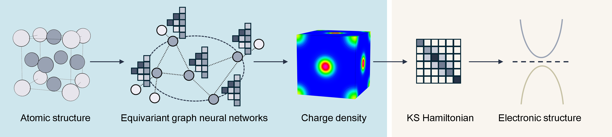

# EdenGNN

**EdenGNN** (Equivariant Density Graph Neural Network) is an open framework for accurate and efficient charge density prediction. Integrated with DFT softwares, it can predict electronic structures directly from atomic configurations.

---

- [Features](#features)
- [Installation](#installation)
- [Usage](#-usage)
  - [Data Preparation](#data-preparation)
  - [Training](#training)
  - [Prediction](#prediction)
- [Pre-trained Models](#pre-trained-models)
- [Troubleshooting](#troubleshooting)
- [Citation](#citation)

---

## Features



- **Bypassing the self-consistent calculations of the Kohn-Sham (KS) equations:** The predicted charge density can be used to construct the KS Hamiltonian and calculate the electronic structures.

- **Support various DFT implementations:** EdenGNN can predict the **augmentation occupancies** in the projector augmented-wave (PAW) formalism, making it capable of predicting the electronic structures with the accuracy of both the plane-wave (PW) basis and the linear combination of atomic orbital (LCAO) basis.


## Installation

1. Clone the repository and install it via `pip`:

```bash
git clone https://github.com/rubenlee11/EdenGNN.git
cd EdenGNN
pip install .
```

For offline installation, use:

```bash
pip install . --no-index --no-build-isolation
```

Note that a fortran compiler (such as gfortran) is needed.

2. Prepare your DFT softwares.

- For performing non-self-consistent calculations in **OpenMX** 3.9 with predicted charge density, you need to recompile **OpenMX** with the patch files provided in `./scripts/openmx/patch_nsc`.

- For performing non-self-consistent calculations in **ABACUS** 3.10.0 with predicted difference charge density, you need to recompile **ABACUS** with the patch files provided in `./scripts/abacus/patch_deltarho`.

- For performing non-self-consistent calculations in **SIESTA** with predicted difference charge density, you need to compile it with **NetCDF** support.

## Usage

You can run **EdenGNN** examples directly in your browser using the Google Colab [link](https://colab.research.google.com/drive/1tSGPZk4XI71GEylYeNDD1218smOEaFKc?usp=sharing). Some trained model weights are stored at the Hugging Face [repository](https://huggingface.co/TrueSavage/EdenGNN), and example density files can be downloaded via this [link](https://huggingface.co/datasets/TrueSavage/EdenGNN-Data). Detailed parameter descriptions can be found in `config.yaml`.


* **Important Note:** The following instructions are tailored for the VASP software using PAW pseudopotentials.

* DFT calculation settings, for example, the pseudopotentials, the Brillouin zone sampling density for integration, and the energy cutoff for FFT grids, should be consistent across your dataset and workflow. 

### Data Preparation

#### 1. Calculate Superposition of Atomic Charge Density (VASP only)

This step is necessary for **VASP** but not **OpenMX**. In self-consistent and non-self-consistent calculations, **OpenMX** stores and reads the difference charge density in the restart files.

Run **VASP** to obtain the Superposition of Atomic Charge Density (SACD). This serves as the physical prior for the $\Delta$-Learning strategy and is **required for both training and prediction**.
- **VASP Tags:** Set `ICHARG = 12`, `NELM = 0`, and `ISPIN = 1`.

#### 2. Calculate Self-Consistent Charge Density (Training Only)

Perform normal self-consistent DFT calculations to generate the ground truth data.
- **Consistency is Key:** When using **VASP** to label data, ensure the precision settings match those used in the SACD calculations (except for `KPOINTS` and `ISMEAR`). Inconsistent grids between pseudo charge densities will raise errors.

#### 3. Create Filelists

Create text files for training, validation, and test sets. 

For **VASP** mode, the filelists should contain the absolute paths to the working directories of the **SACD** calculations.

Example:
```text
/root/.../si/vasp_run_sacd/1_0
/root/.../si/vasp_run_sacd/1_1
...
```

For **OpenMX** mode, the filelists should contain the absolute paths to: the working directories of the DFT calculations in the training stage; or the cif files in the prediction stage.

Example:
```text
/root/.../si/openmx_run/1_0
/root/.../si/openmx_run/1_1
...
```

```text
/root/.../si/openmx_run/1_0.cif
/root/.../si/openmx_run/1_1.cif
...
```


### Training

#### 1. Configure `config.yaml`

Modify your configuration file with the following key settings:

- **Set `run.task`:**
  - `0`: Train the pseudo charge density.
  - `1` Train the augmentation occupancies.
  - `2` Train both. 
  
- **Fine-tuning (Optional):** set `run.checkpoint` to the path of your checkpoint file. 

- **Set `data.dft_software`**.

- **Directories:** 
  - `run.save_dir`: Directory to save logs and checkpoints.
  - `data.dir`: Directory storing your SCF calculations. Directory names here must match those in your filelists. This tag is needed when `data.dft_software` is `vasp`. 
  - `data.path_train` & `data.path_val`: Paths to your training and validation filelists.

- **Optimization:** 
  - Set the initial learning rate via `optimize.lr`.
  - The total loss is a weighted sum: $\mathcal{L} = \sum_{i} w_i \mathcal{L}_i$. Specify the gradient ratios in `optimize.loss_dict.grid_func_out` and `optimize.loss_dict.aug_tensor` if training both tasks (`run.task: 2`). When using **OpenMX**, only the charge density is trained, hence the weight of `grid_func_out` is `1.0`.


- **Model Parameters:** 
  - Set `model.lmix_max` to match the `LMAXMIX` tag used in your VASP dataset (must be consistent across all structures). 
  - Default values for other model parameters are generally robust.

#### 2. Start Training
```bash
edengnn-train --config path/to/config.yaml
```

### Prediction

#### 1. Configure `config.yaml`

- **Set `data.dft_software`**.

- **Set `run.checkpoint`** to the path of the checkpoint file of your trained model. 

- **Set `path_predict`** to the filelist (explained in the **Data Preparation** section).

- **Set `path_template`** to the path of the template files of band structure calculation settings for the DFT softwares.

- **Note:** All model hyperparameters in the `config.yaml` (including `run.task`) must strictly match those of the checkpoint.

#### 2. Run Prediction
```bash
edengnn-predict --config path/to/config.yaml
```

## Pre-trained Models

### Universal Charge Density for VASP

**EdenGNN-Uni** is a pre-trained universal charge density model trained on non-magnetic materials from the Materials Project database. 

To use EdenGNN-Uni for predicting electronic structures, please ensure that your input structures use the **exact same PAW pseudopotential versions** as those used as the training set.

### Universal Charge Density for ABACUS

This pre-trained models can be downloaded from the Hugging Face [repository](https://huggingface.co/TrueSavage/EdenGNN). The training datasets consists of 50,000 non-magnetic structures fetched from the original Materials Project database. 

To use this pre-trained model for band structure predictions, firstly we need to compile the modified ABACUS code, install the corresponding pseudopotential and basis sets used in the training datasets.

* Apply the patch by copying the contents of `scripts/abacus/patch_deltarho` to the source code directory of **ABACUS** v3.10.0, overwriting the existing files, and then compile it.

* Download the SG15 pseudopotentials and the standard atomic orbitals from [here](https://abacus.ustc.edu.cn/pseudo/list.htm), and install them following the instructions in the ASE ABACUS [interface](https://gitlab.com/1041176461/ase-abacus). Ensure that ASE can access the pseudopotentials and basis sets through the environment variables `ABACUS_PP_PATH` and `ABACUS_ORBITAL_PATH`.

During the predicting stage, first configure the parameters for model prediction, and then execute band diagonalization using the modified **ABACUS** executable.

* Set the `save_dir`, `checkpoint`, `path_predict` and optionally `chunk_size_predict` to optimize performance. The detailed definitions of these tags can be found in the example `config.yaml` file. Specifically, `path_predict` should point to a `filelist.txt` containing the paths of the structure files (e.g., `.cif` or `POSCAR`).

* Run with `edengnn-predict --config /path/to/config.yaml`.

* Run **ABACUS** in the resulting directories which contains the input parameters and the predicted difference charge density files. 

## Troubleshooting

If you encounter with out of memory (OOM) errors when training or predicting the pseudo charge density, try the following solutions:

1. Decrease the `model.chunk_size_train` variable. This parameter controls the number of radial points processed simultaneously during training.
2. Decrease the maximum number of grids for structures in your training set.
3. Reduce the number of channels: `model.probe.conv.n_channels`.
4. In VASP, `PREC = Normal` is accurate enough for band structures. `PREC = Accurate` results denser grid and slows down training. 

## Citation

If you find EdenGNN useful in your research, please cite our paper:
```
X. Li, Z. Xin, H. Yu, Y. Zhong, X. Gong, and H. Xiang, Efficient E(3)-Equivariant Framework for Universal Charge Density Prediction, arXiv:2510.00788.
```
